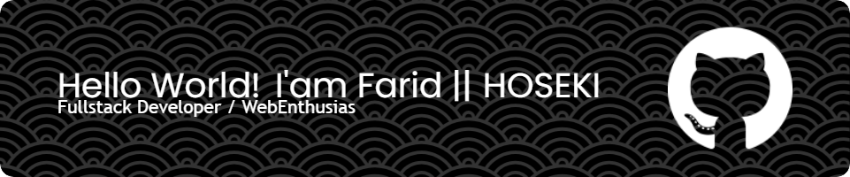

## Hello World, I'm Farid aka HOSEKI 🎇

<!--
**HOSEKI7/HOSEKI7** is a ✨ _special_ ✨ repository because its `README.md` (this file) appears on your GitHub profile.

Here are some ideas to get you started:

- 🔭 I’m currently working on ...
- 🌱 I’m currently learning ...
- 👯 I’m looking to collaborate on ...
- 🤔 I’m looking for help with ...
- 💬 Ask me about ...
- 📫 How to reach me: ...
- 😄 Pronouns: ...
- ⚡ Fun fact: ...
-->

- 🎓 I’m currently an **Informatic Engineering** student on **Universitas Mikroskil**
- 📖 I’m currently learning [**React**]("https://react.dev/") and [**NextJS**]("https://nextjs.org/) Framework
- 😤 Pronouns: He/Him
- ⚡ Fun fact: I cant watching movies or something while eat

#### 💻Tech Stack

**
Languages:
**

     

**
Frameworks & Libraries:
**

      

**
Databases:
**

 

**
Tools & Softwares:
**

         

#### 🎠 Where you can find me

   
 